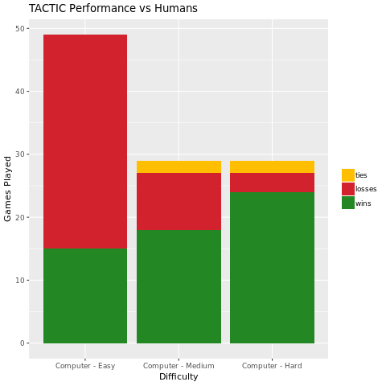

# TACTIC

An Ultimate Tic-Tac-Toe Player

[Play the game](https://arnav-b.github.io/tactic/)

### About

TACTIC uses variations of [minimax](https://en.wikipedia.org/wiki/Minimax) with
alpha-beta pruning. Hard mode searches to depth 5, medium searches to depth 3, and 
easy either plays randomly or searches to depth 2 with equal probability. We have also 
implemented [Monte Carlo tree search](https://en.wikipedia.org/wiki/Monte_Carlo_tree_search), though our implementation seems to be only slightly better than random play.

### Win Tracker

In development, we tested TACTIC against randomly-generated moves.
As we collect data, we'll update the tracker with the algorithm's performance
against human opponents.

